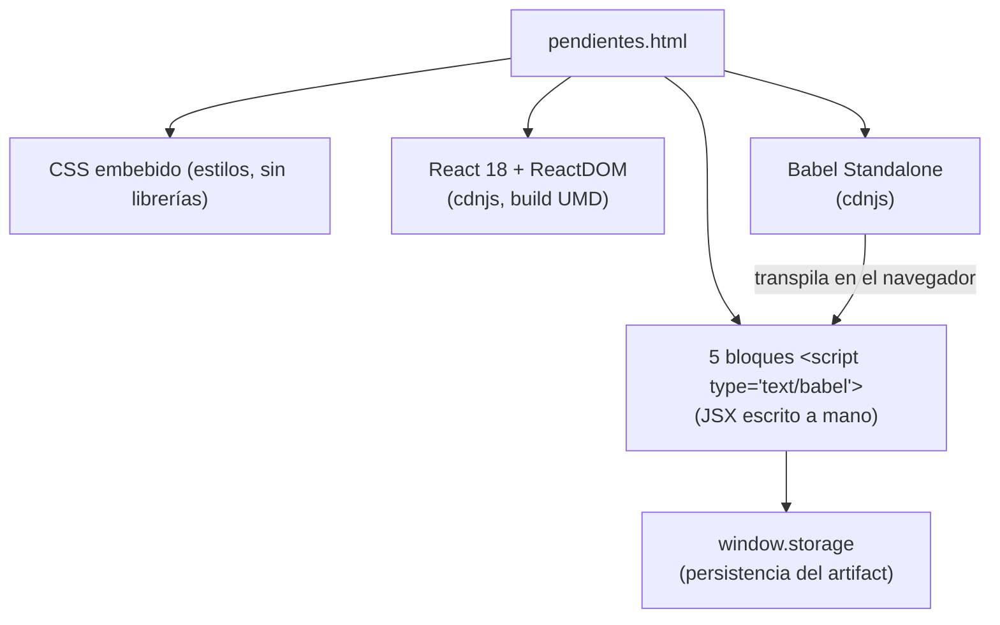
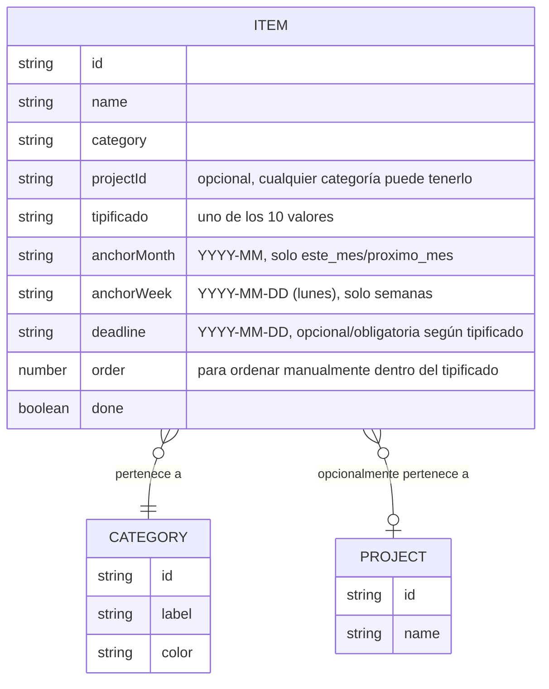
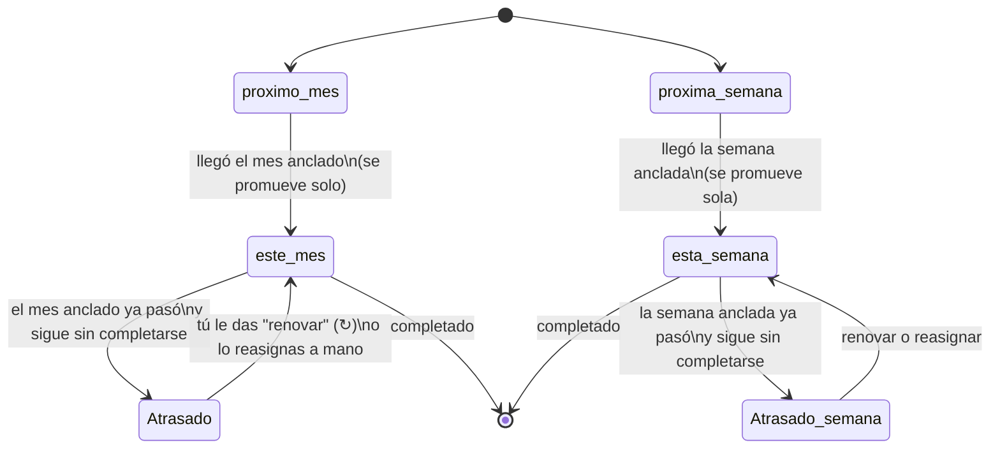

# Mis Pendientes — documentación técnica

Este documento explica cómo está construido `pendientes.html` para que puedas
entenderlo y modificarlo más adelante sin tener que releer todo el código.

## 1. Qué es

Un árbol de pendientes personal con:
- Categorías (CESDE, Proyectos Propios, Aprendizaje, Personales, BMW, Diseño).
- Proyectos opcionales dentro de **cualquier** categoría, para no mezclar temas.
- Un sistema de **tipificados** (10 estados posibles) que reemplaza la idea de
  "mes asignado" + "enviar a la semana" que usábamos antes.
- Topes por categoría/proyecto, vencimiento automático y promoción automática
  de mes/semana, todo anclado a la hora de Medellín.

## 2. Arquitectura: un solo archivo, sin build

`pendientes.html` es un único archivo autocontenido:



No hay `npm install`, ni bundler, ni paso de compilación: el navegador
descarga Bootstrap, React/ReactDOM/Babel desde CDN, Babel convierte el JSX a
`React.createElement(...)` **en el momento de abrir el archivo**, y React
monta la app en `<div id="root">`. Por eso puedes abrirlo con doble clic en
cualquier navegador, o como artifact dentro de Claude.

**Bootstrap 5 (tema oscuro) es la base del diseño**, cargado por `<link>`
desde cdnjs, con `data-bs-theme="dark"` en el `<html>`. Nuestra paleta
(verde bosque, acentos por categoría) se aplica *encima* redefiniendo las
variables CSS propias de Bootstrap (`--bs-body-bg`, `--bs-body-color`,
`--bs-border-color`, etc.), así que todo lo que ya trae Bootstrap —botones,
inputs, badges, el fondo del body— hereda automáticamente buen contraste,
en vez de depender solo de reglas nuestras hechas a mano. Los botones,
campos de formulario y etiquetas usan clases reales de Bootstrap (`btn`,
`form-control`, `form-select`, `badge`) además de las nuestras. Lo único
100% a medida es la red de nodos del Árbol y las notas flotantes, que no
tienen equivalente en Bootstrap.

**Fondo de partículas (tsParticles v3, cdnjs) y glassmorphism**: un
`<div id="tsparticles">` fijo detrás de todo (`z-index:0`) muestra puntos
que se conectan entre sí y con el cursor al pasar cerca — se inicializa
una sola vez en un `useEffect` de `App`, fuera del ciclo de render de
React (tsParticles maneja su propia animación). `.pnd-app` ahora tiene
fondo transparente para dejarlo ver. Los modales (`.pnd-modal`) y las
columnas del Tablero (`.tab-col`) usan `backdrop-filter: blur(...)` sobre
un fondo semitransparente — efecto vidrio esmerilado — con suficiente
opacidad para que el texto se siga leyendo bien encima, sin importar qué
tan ocupado esté el fondo. Si `tsParticles` no llega a cargar por algún
motivo, la app sigue funcionando igual (el `useEffect` simplemente no
hace nada).

Los 5 bloques de `<script type="text/babel">` son, en orden:
1. Constantes y funciones puras (categorías, tipificados, fechas, reglas de
   vencimiento/tope). **Esta es la parte más importante y la más fácil de
   probar aislada**, porque no toca React para nada.
2. El Árbol como red interactiva: `CategoryNode` → `ProjectNode` → `ItemNode`
   (se van expandiendo unos dentro de otros), el detalle de un pendiente
   (`ItemDetailPopover`), las notas flotantes (`FloatingNote`) y los modales
   de asignar/crear proyecto (`AssignProjectModal`, `NewProjectModal`).
3. El formulario de crear/editar un pendiente (`ItemFormModal`), donde vive
   la validación de tope y fecha límite.
4. El Tablero (vista por tipificado) y el aviso de atrasados.
5. El componente `App` (estado global, carga/guardado, y arma todo lo de
   arriba).

Como no son módulos ES, todos comparten el mismo scope global del navegador —
por eso el orden de los bloques en el HTML importa.

## 3. Modelo de datos



Todo se guarda como un único JSON bajo la llave
`pendientes-tipificados-state-v1`:

```json
{
  "items": [ /* array de Item */ ],
  "projects": { "proyectos": [ /* Project */ ], "diseno": [ /* Project */ ] },
  "notes": [ { "id": "...", "text": "...", "x": 120, "y": 80 } ]
}
```

`notes` son las notas flotantes tipo Post-it sobre el lienzo del Árbol
(`x`/`y` en píxeles, relativos a la esquina superior izquierda del lienzo).
Una nota deja de existir en cuanto se arrastra sobre una categoría: en ese
momento se convierte en un `Item` real y se borra del array `notes`.

`projects` es un diccionario por categoría — **cualquier** categoría puede
tener cero, uno o varios proyectos (no está limitado a Proyectos
Propios/Diseño). Un `Item` sin `projectId` vive directo en su categoría.

## 4. Categorías y proyectos

Las categorías son fijas (`CATEGORIES`): CESDE, Proyectos Propios,
Aprendizaje y ejercicios, Pendientes Personales, BMW, Diseño. **Cualquier
categoría puede tener proyectos opcionales** — no es que unas los
necesiten y otras no: cada categoría puede tener cero, uno o varios
proyectos, y sus pendientes pueden ir directo en la categoría o dentro de
uno de sus proyectos. La `CategorySystemView` muestra siempre las dos
cosas juntas (proyectos como lunas + pendientes directos como satélites),
con sus propios botones "+ Nuevo proyecto" y "+ Nuevo pendiente". El
anillo tipo Saturno en el planeta de una categoría solo indica que *ahora
mismo* tiene al menos un proyecto creado — no es una propiedad fija.

## 5. Los 10 tipificados

Cada pendiente tiene **exactamente uno**. Viven en la constante `TIPIFICADOS`:

| Tipificado | Alcance | Tope | ¿Pide fecha límite? |
|---|---|---|---|
| Esta semana | semana | 5 por categoría/proyecto | Sí |
| Siguientes actividades | semana | 8 por categoría/proyecto | Sí |
| Próxima semana | semana | sin tope | Sí |
| Este mes | mes | 20 por categoría/proyecto | Sí |
| Próximo mes | mes | 20 por categoría/proyecto | No |
| Obligatorios | — | sin tope | No |
| Los que yo quiero hacer | — | sin tope | No |
| Sin tipificar | — | sin tope | No |
| Urgentes | — | sin tope | No |
| Importantísimas | — | sin tope | No |

Los 5 primeros son "temporales": tienen un ancla (`anchorMonth` o
`anchorWeek`) que se compara contra la fecha real para saber si siguen
vigentes, si ya se vencieron, o si ya deberían promoverse.

## 6. Vencimiento y promoción automática

Esta es la regla que más vale la pena entender bien, porque es la que corre
sola cada vez que abres la app (función `reconcile`, y el chequeo
`isOverdue`, ambas en el primer bloque de script):



Puntos clave:
- **Próximo mes / Próxima semana nunca se marcan como atrasados** — cuando
  llega su momento, pasan solos a "Este mes" / "Esta semana". Esto corre una
  vez por sesión, apenas cargan los datos (`reconciledRef` en `App`
  evita que se repita en cada render).
- **Este mes / Esta semana / Siguientes actividades sí se marcan atrasados**
  cuando su ancla ya quedó en el pasado y el pendiente sigue sin
  completarse. Esto **no cambia el dato guardado** — se calcula al vuelo con
  `isOverdue()` cada vez que se dibuja la pantalla. Por eso "renovar" es una
  acción aparte: actualiza el ancla al período actual.
- Un atrasado **no cuenta para el tope** del período viejo ni del nuevo,
  hasta que lo renuevas o lo reasignas — así no te bloquea sin querer.

## 7. Topes por categoría/proyecto

`countActiveForCap()` cuenta cuántos pendientes activos (no completados, no
vencidos) hay con la misma categoría (o el mismo proyecto, si la categoría
tiene subproyectos) y el mismo tipificado+ancla. Si al crear o editar un
pendiente ese conteo ya llegó al tope, el formulario bloquea el guardado con
un mensaje explicando qué hacer (completar, borrar o mover algo primero).

Importante: el tope es **por categoría o por proyecto**, no global — CESDE
puede tener sus 20 de "Este mes" y, aparte, cada proyecto dentro de
"Proyectos Propios" tiene los suyos, sin pisarse entre sí.

## 8. Zona horaria

`todayInMedellin()` usa `Intl.DateTimeFormat` con `timeZone: "America/Bogota"`
para sacar año/mes/día reales, sin importar en qué huso esté configurado el
navegador de quien lo abre. A partir de ahí:
- `currentMonthKey` / `nextMonthKey`: mes actual y siguiente (`YYYY-MM`).
- `currentWeekStart`: el **lunes** de la semana en curso (`mondayOf`), porque
  la semana ahora corre lunes a domingo.

## 9. Las dos vistas

- **Árbol — cosmos navegable, sin rotación**: la Galaxia (el sol al centro
  con el total de pendientes, y las categorías esparcidas alrededor en
  espiral — con un anillo tipo Saturno las que tienen subproyectos), la
  vista de una categoría (ella al centro, sus proyectos o pendientes
  esparcidos) y la vista de un proyecto (él al centro, sus pendientes
  esparcidos). Cada cuerpo es un emoji descriptivo (🎓 CESDE, 🚀 Proyectos
  Propios, 🧠 Aprendizaje, 🏡 Personales, 🚘 BMW, 🎨 Diseño; ✦ para un
  pendiente suelto), con forma de blob orgánico (no un círculo perfecto)
  que respira y flota levemente — pero **nunca gira**, así el texto
  siempre se puede leer. La posición de cada cuerpo es fija, repartida en
  espiral (ángulo dorado) para que se sienta más como una galaxia dispersa
  que como órbitas de sistema solar. Cada vista tiene un botón claro
  "← Volver" arriba. Tocar un pendiente abre un popover compacto con sus
  datos y acciones. Solo se muestran los pendientes activos.

  *(Antes el anillo completo giraba y cada nodo solo cancelaba el giro del
  tiempo, no el ángulo fijo de su propia posición — por eso los del lado
  opuesto se veían boca abajo. Se corrigió quitando la rotación por
  completo en vez de intentar parchear la cuenta.)*

  **Notas flotantes**: solo existen en la Galaxia, y ahora piden **dos
  toques** para crearse — el primero marca el lugar (con un aviso
  parpadeante que expira solo a los 3 segundos si no confirmas), el
  segundo la crea ahí. Se arrastran igual que antes hasta el planeta de
  una categoría para asignarlas.
- **Tablero**: mantiene su formato de columnas (no se volvió parte del
  cosmos, para no perder la claridad de una lista priorizable), pero ahora
  comparte el mismo lenguaje visual — cada tipificado tiene su propio
  emoji (🌕 Esta semana, 🌖 Siguientes actividades, 🌗 Próxima semana, 🪐
  Este mes, 🌌 Próximo mes, ⚓ Obligatorios, ✨ Quiero hacer, ☄️ Sin
  tipificar, 🔥 Urgentes, ⭐ Importantísimas) y los puntos de semáforo
  llevan un resplandor sutil a juego con los nodos del Árbol.

## 10. Datos de prueba

Un botón "Insertar 50 datos de prueba" genera pendientes y proyectos de
ejemplo (marcados internamente con `seed: true`) repartidos entre todas
las categorías y tipificados, incluyendo dos ya vencidos a propósito para
que veas el aviso de atrasados funcionando. Volver a pulsarlo reemplaza el
lote anterior (no se acumulan). El botón "Eliminar datos de prueba" solo
aparece si hay datos de prueba cargados, y pide escribir exactamente un
query (`DELETE FROM pendientes WHERE es_prueba = true;`) antes de borrar —
nada de esto toca lo que el usuario haya agregado por su cuenta.

## 11. Migración de datos reales

`buildRealDataV2()` y la bandera `realDataV2Injected` existen para un caso
puntual: la primera vez que se abre esta versión del archivo, se limpian
los datos de prueba (`seed: true`) y cualquier resto de la migración v1
anterior (por nombre, ver `KNOWN_V1_NAMES`), y se inyectan los pendientes
reales que Chipi confirmó, ya con categoría y proyecto correctos (no
adivinados). Esto corre una sola vez — la bandera queda guardada junto con
los datos, así que abrir el archivo de nuevo no vuelve a insertar nada ni
duplica lo que ya había, y respeta cualquier pendiente que el usuario haya
agregado a mano entre medio. Si más adelante se necesita otra migración de
este estilo, el patrón es el mismo: una función `buildXxxV3()`, una
bandera nueva, y el mismo chequeo en el efecto de carga.

## 12. Respaldo

El guardado es automático (`window.storage`, cada vez que cambian `items` o
`projects`). Además hay botones de **Descargar respaldo** (baja un `.json`)
y **Restaurar respaldo** (lo vuelve a cargar, pidiendo confirmación antes de
reemplazar lo que haya). Útil sobre todo porque `window.storage` solo
funciona dentro de Claude — una copia descargada y abierta afuera no
recuerda datos entre visitas, así que el `.json` es tu respaldo real.

## 13. Cómo modificar lo más común

- **Agregar una categoría**: añade un objeto a `CATEGORIES` (id, label,
  color, emoji). Los proyectos ya son opcionales para cualquier categoría,
  no hace falta marcar nada aparte.
- **Agregar un tipificado**: añade un objeto a `TIPIFICADOS` (scope, cap,
  needsDeadline). Si su scope es "month" o "week", súmalo también a la
  lógica de `anchorFor()` (en `ItemFormModal`) y a `reconcile()`/`isOverdue()`
  si necesitas que se promueva o se marque atrasado igual que los demás.
- **Cambiar un tope**: solo cambia el número `cap` de ese tipificado en
  `TIPIFICADOS`.
- **Cambiar la zona horaria**: cambia el `timeZone` dentro de
  `todayInMedellin()`.
- **Cambiar el día de inicio de semana**: ajusta el cálculo de `offset` en
  `mondayOf()`.

## 14. Qué se probó antes de entregarlo

Antes de entregar este archivo, la lógica de fechas (`reconcile`,
`isOverdue`, `countActiveForCap`, `mondayOf`) se probó por separado con
casos concretos (cruce de mes, cruce de semana, topes por proyecto), y
además se probó la app completa simulando clics reales: crear un pendiente,
llenar 20 en una categoría y confirmar que el 21 se bloquea con el mensaje
correcto, simular que cambia el mes real y ver que uno se promueve y el
otro aparece como atrasado, y usar el botón "renovar". No se incluyeron
datos de ejemplo en el archivo final — lo que ves al abrirlo es un árbol
vacío, listo para que tú cargues tus pendientes reales.
